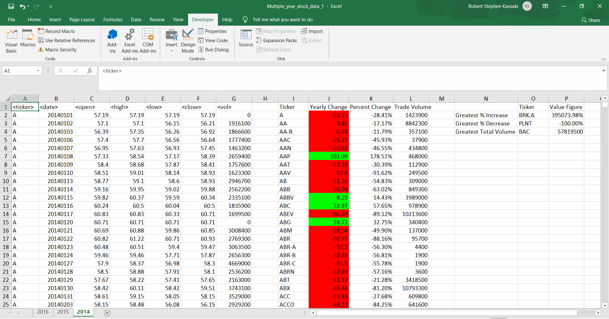
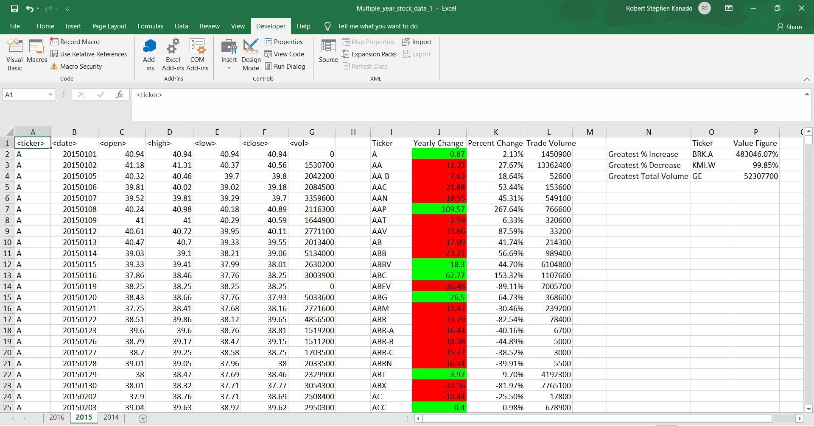
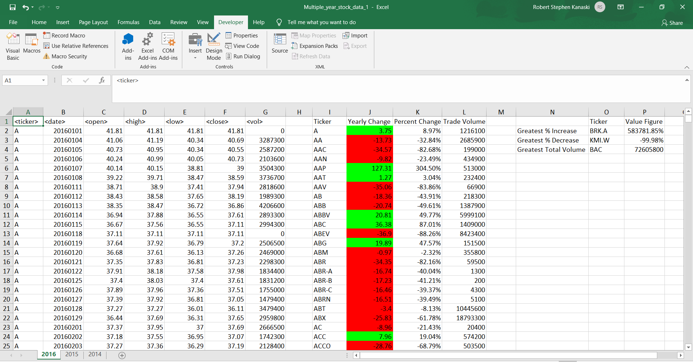

# VBA_Stocks_Challenge
Used Macros/VBA scripting to loop through all spreadsheets of 2014, 2015, and 2016 stock data to determine yearly change, percent yearly change, and total stock volume and applied conditional formatting to show positive and negative change.

